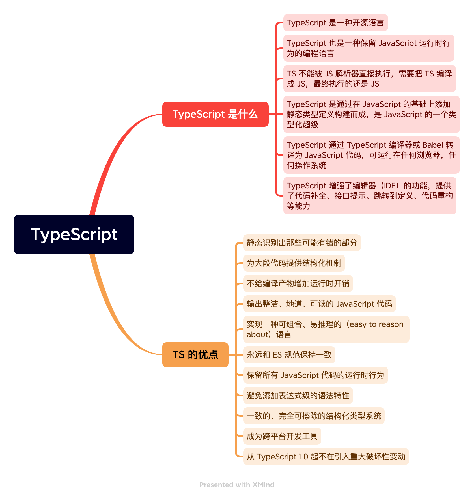

# TypeScript



## TS 的安装编译

约定使用 TypeScript 编写的文件以  `.ts`  为后缀，用 TypeScript 编写 React 时，以  `.tsx`  为后缀。

TypeScript 安装：

```bash
npm install -g typescript
```

查询 TypeScript 版本:

```bash
npm view typescript version
# or
tsc -v
```

编译一个 TypeScript 文件:

```bash
tsc xxxx.ts
```
