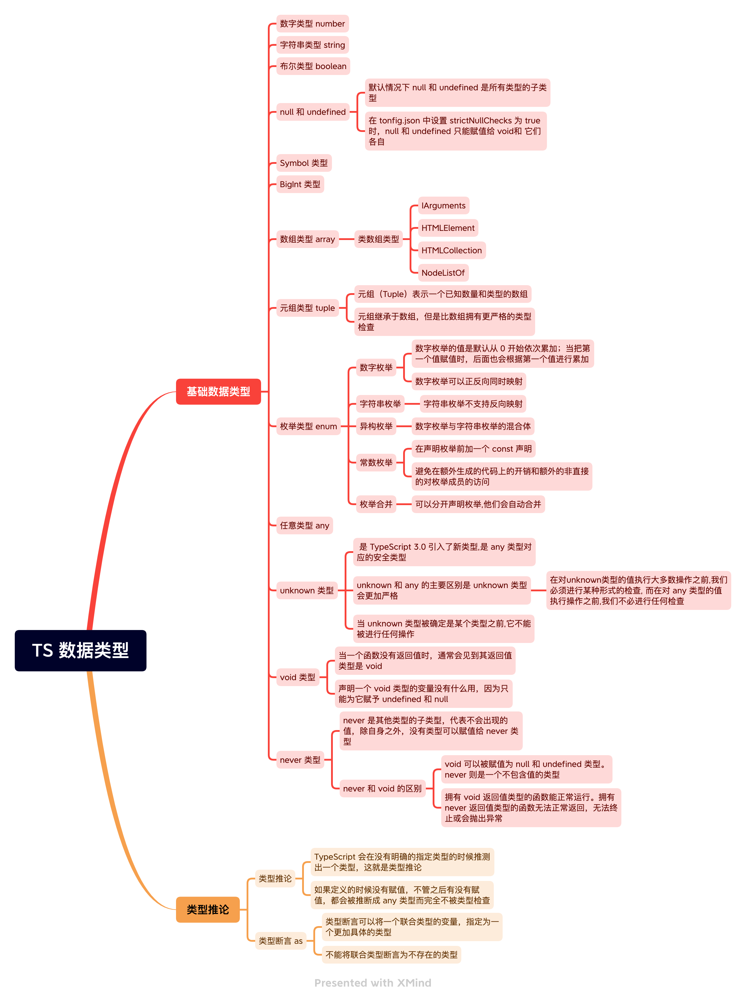

# TS 数据类型



## 枚举的本质

我们以下面的枚举为例：

```ts
enum Gender {
  GIRL,
  BOY,
}

console.log(`李雷是${Gender.BOY}`);
console.log(`韩梅梅是${Gender.GIRL}`);
```

编译后的 .js 文件内容如下：

```js
var Gender;
(function (Gender) {
  Gender[(Gender['GIRL'] = 0)] = 'GIRL';
  Gender[(Gender['BOY'] = 1)] = 'BOY';
})(Gender || (Gender = {}));
console.log('\u674E\u96F7\u662F'.concat(Gender.BOY));
console.log('\u97E9\u6885\u6885\u662F'.concat(Gender.GIRL));
```

原理解析：

- 第一步，声明一个 `Gender` 变量并且初始值是空对象；

- 第二步，将 `Gender` 对象作为自执行函数的实参传入；

- 第三步，给 `Gender` 对象 的 “GIRL” 属性赋值为 0；

```js
Gender = {
  GIRL: 0,
};
```

第四步，给 Gender 对象 新增一个 属性名为“0” 的属性，并且给其赋值为 "GIRL"；

```js
Gender = {
  GIRL: 0,
  0: 'GIRL',
};
```

以此类推...

所以最终的 Gender 对象 应该为:

```js
Gender = {
  GIRL: 0,
  BOY: 1,
  0: 'GIRL',
  1: 'BOY',
};
```

这也是为什么枚举可以正反向同时映射的原因。

> 正向映射即：`name => value`, 反向映射即： `name <=> value`。
