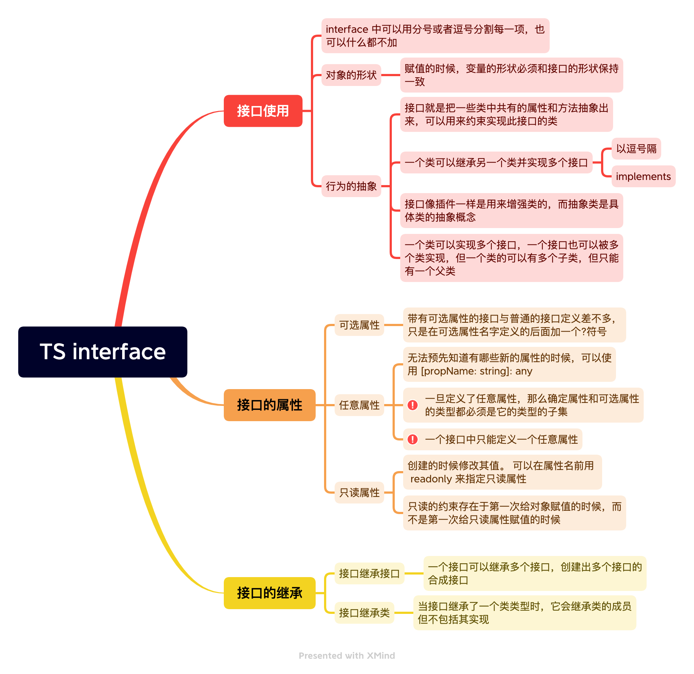

# TS 接口



## readonly vs const

最简单判断该用 `readonly` 还是 `const` 的方法是看要把它做为变量使用还是做为一个属性。做为变量使用的话用 `const`，若做为属性则使用 `readonly`。

- `readonly` 修饰的变量只能在**构造函数**中初始化；
- 在 TS 中，`const` 是**常量**标志符，其值不能被重新分配；
- TS 的类型系统同样允许 `interface`、`type`、`class` 上的属性标识为 `readonly`；
- `readonly` 实际上只是在**编译阶段**进行代码检查。而 `const` 则会在**运行**时检查（在支持 `const` 语法的 JS 运行时环境中）；

## 为什么 TypeScript 会支持接口继承类呢？

以下述为例：

```ts
class Point {
  x: number;
  y: number;

  constructor(x: number, y: number) {
    this.x = x;
    this.y = y;
  }
}

interface Point3d extends Point {
  z: number;
}

let point3d: Point3d = { x: 1, y: 2, z: 3 };
```

实际上，当我们在声明 `class Point` 时，除了会创建一个名为 `Point` 的类之外，同时也创建了一个名为 `Point` 的类型（实例的类型）。

所以我们既可以将 `Point` 当做一个类来用（使用 `new Point` 创建它的实例），也可以将 `Point` 当做一个类型来用（使用 `: Point` 表示参数的类型）：

```ts
class Point {
  x: number;
  y: number;

  constructor(x: number, y: number) {
    this.x = x;
    this.y = y;
  }
}

const p = new Point(1, 2); // 当做一个类来用

function printPoint(p: Point) {
  // 当做一个类型来用
  console.log(p.x, p.y);
}

printPoint(new Point(1, 2));
```

这个例子实际上可以等价于：

```ts
class Point {
  x: number;
  y: number;

  constructor(x: number, y: number) {
    this.x = x;
    this.y = y;
  }
}

interface PointInstanceType {
  x: number;
  y: number;
}

const p = new Point(1, 2);

function printPoint(p: PointInstanceType) {
  console.log(p.x, p.y);
}

printPoint(new Point(1, 2));
```

上例中我们新声明的 `PointInstanceType` 类型，与声明 `class Point` 时创建的 `Point` 类型是等价的。

所以回到 `Point3d` 的例子中，我们就能很容易的理解为什么 TypeScript 会支持接口继承类了：

```ts
class Point {
  x: number;
  y: number;

  constructor(x: number, y: number) {
    this.x = x;
    this.y = y;
  }
}

interface PointInstanceType {
  x: number;
  y: number;
}

// 等价于 interface Point3d extends PointInstanceType
interface Point3d extends Point {
  z: number;
}

let point3d: Point3d = { x: 1, y: 2, z: 3 };
```

当我们声明 `interface Point3d extends Point` 时，`Point3d` 继承的实际上是类 `Point` 的实例的类型。

换句话说，可以理解为定义了一个接口 `Point3d` 继承另一个接口 `PointInstanceType`。

**所以「接口继承类」和「接口继承接口」没有什么本质的区别。**

值得注意的是，`PointInstanceType` 相比于 `Point`，缺少了 `constructor` 方法，这是因为声明 `Point` 类时创建的 `Point` 类型是不包含构造函数的。另外，除了构造函数是不包含的，静态属性或静态方法也是不包含的（实例的类型当然不应该包括构造函数、静态属性或静态方法）。

换句话说，声明 `Point` 类时创建的 `Point` 类型只包含其中的实例属性和实例方法：

```ts
class Point {
  /* 静态属性，坐标系原点 */
  static origin = new Point(0, 0);
  /* 静态方法，计算与原点距离 */
  static distanceToOrigin(p: Point) {
    return Math.sqrt(p.x * p.x + p.y * p.y);
  }

  /* 实例属性，x 轴的值 */
  x: number;
  /* 实例属性，y 轴的值 */
  y: number;

  /* 构造函数 */
  constructor(x: number, y: number) {
    this.x = x;
    this.y = y;
  }
  /* 实例方法，打印此点 */
  printPoint() {
    console.log(this.x, this.y);
  }
}

interface PointInstanceType {
  x: number;
  y: number;

  printPoint(): void;
}

let p1: Point;
let p2: PointInstanceType;
```

上例中最后的类型 `Point` 和类型 `PointInstanceType` 是等价的。

同样的，在接口继承类的时候，也只会继承它的实例属性和实例方法。

## 函数类型接口

除了描述带有属性的普通对象外，接口也可以描述函数类型。

```ts
interface SearchFunc {
  (source: string, subString: string): boolean;
}
```

这样定义后，我们可以像使用其它接口一样使用这个函数类型的接口。

```ts
let mySearch: SearchFunc;
mySearch = function (source: string, subString: string) {
  let result = source.search(subString);
  return result > -1;
};
```

对于函数类型的类型检查来说，函数的参数名不需要与接口里定义的名字相匹配。

## 可索引类型接口

> 用来对数组和对象进行约束

与使用接口描述函数类型差不多，我们也可以描述那些能够“通过索引得到”的类型，可索引类型具有一个   索引签名，它描述了对象索引的类型，还有相应的索引返回值类型。

```ts
interface StringArray {
  [index: number]: string;
}

let myArray: StringArray;
myArray = ['Bob', 'Fred'];
// 或者 myArray = { 0: "Bob", 1: "Fred" };

let myStr: string = myArray[0];
```
