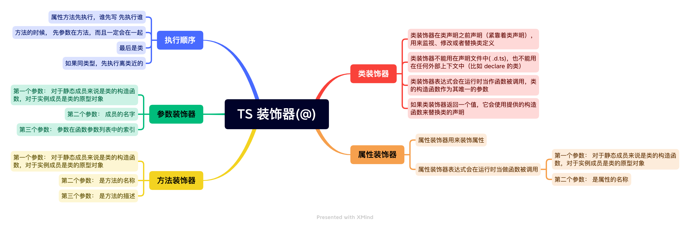

# 装饰器 @

装饰器是一种特殊类型的声明，它能够被附加到类声明、方法、属性或者参数上。

- 语法：装饰器使用 `@expression` 这种形式，`expression` 求值后必须为一个函数，它会在运行时被调用，被装饰的声明信息做为参数传入
- 若要启用实验性的装饰器特性，必须 tsconfig.JSON 里启用 experimentalDecorators 编译器选项
- 常见的装饰器有: 类装饰器、属性装饰器、方法装饰器、参数装饰器
- 装饰器的写法: 分为普通装饰器(无法传参）和装饰器工厂(可以传参)

## 普通装饰器

```ts
interface Person {
  name: string;
  age: string;
}

function enhancer(target: any) {
  target.prototype.name = '金色小芝麻';
  target.prototype.age = '18';
}

@enhancer // 普通装饰器
class Person {
  constructor() {}
}
```

## 装饰器工厂

```ts
interface Person {
  name: string;
  age: number;
}

// 利用函数柯里化解决传参问题， 向装饰器传入一些参数，也可以叫 参数注解
function enhancer(name: string) {
  return function enhancer(target: any) {
    // 这个 name 就是装饰器的元数据，外界传递进来的参数
    target.prototype.name = name;
    target.prototype.age = 18;
  };
}

@enhancer('小芝麻') // 在使用装饰器的时候, 为其指定元数据
class Person {
  constructor() {}
}
```

## 装饰器分类


