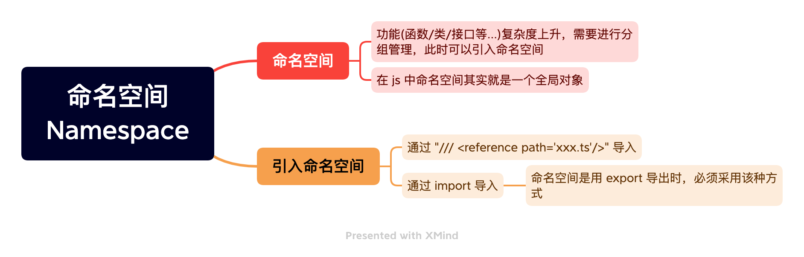

# 命名空间



## 合并多个命名空间

我们知道接口是可以合并的, 命名空间也是可以的, 下面我们把 Vegetables 类型合并到 Food 类型中:

### xxx.ts

```ts
// xxx.ts
namespace Food {
  export interface Fruits {
    taste: string;
    hardness: number;
  }
}
```

### yyy.ts

```ts
// yyy.ts
<reference path="xxx.ts" />;
namespace Food {
  export interface Vegetables {
    title: string;
    heat: number;
  }
}

type Vh = Food.Vegetables['heat']; // number;
```
